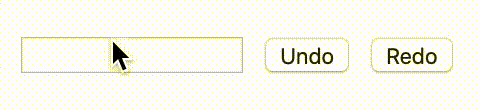

# useDo

A React hook providing Undo and Redo functionalities.

## Demo



Live example on [codesanbox](https://codesandbox.io/s/react-usedo-06oqs)

## Install

```
$ npm install usedo
```

or

```
$ yarn add usedo
```

## Usage

This hook works just like the [useState](https://reactjs.org/docs/hooks-state.html) hook with the addition of four extra parameters.

```javascript
const [state, setState, undo, redo, canUndo, canRedo] = useDo(initialState)
```

- `undo` (function) : reverts the state to its previous value
- `redo` (function) : reverts the undo
- `canUndo` (boolean) : current change can be undone
- `canRedo` (boolean) : current undo can be redone

The canUndo and canRedo can be useful to determine if an 'Undo' or a 'Redo' action should be disabled.

## Example

```javascript
import React from 'react'
import useDo from 'usedo'

function App() {
  const [name, setName, undo, redo, canUndo, canRedo] = useDo('')

  return (
    <form>
      <input
        type="text"
        name="name"
        value={name}
        onChange={evt => setName(evt.target.value)}
      />
      <input type="button" value="Undo" onClick={undo} disabled={!canUndo} />
      <input type="button" value="Redo" onClick={redo} disabled={!canRedo} />
    </form>
  )
}
```
